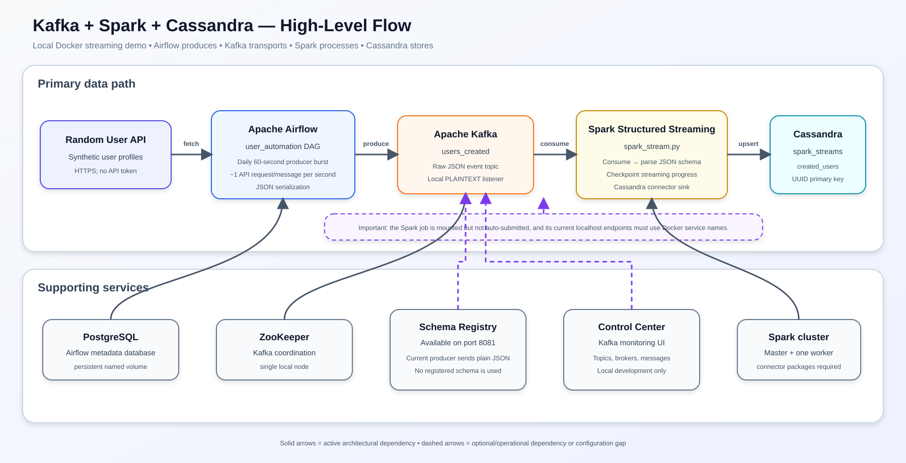

# Kafka + Spark + Cassandra Streaming Pipeline

This project is a local Docker-based streaming demonstration. An Apache Airflow DAG calls the Random User API for 60 seconds, publishes normalized user events to Kafka, and a Spark Structured Streaming job consumes those JSON events and writes them to Cassandra.

The repository also provisions PostgreSQL for Airflow metadata, ZooKeeper for Kafka coordination, Schema Registry, Confluent Control Center, and a single-master/single-worker Spark cluster.

> [!IMPORTANT]
> The architecture is present, but the current repository is not yet one-command end-to-end. The Spark job is mounted into the containers but is not automatically submitted; its Kafka and Cassandra addresses use `localhost`, which is incorrect when the job runs inside Docker; and the Spark image does not install the Python Cassandra driver imported by the script. See [Required fixes before the first complete run](#required-fixes-before-the-first-complete-run).

## Architecture

[Download the PNG flowchart](docs/project-flowchart.png) · [Full-size SVG](docs/project-flowchart.svg) · [Editable Mermaid source](docs/project-flowchart.mmd)



## High-level flow

1. The Airflow DAG `user_automation` runs daily.
2. Its single Python task calls `https://randomuser.me/api/` approximately once per second for 60 seconds.
3. Each API response is normalized into a user event with a generated UUID.
4. The task publishes JSON bytes to the Kafka topic `users_created` through the internal listener `broker:29092`.
5. `spark_stream.py` uses Spark Structured Streaming to consume the topic, parse the JSON fields, and write each micro-batch through the Spark Cassandra connector.
6. Cassandra stores the records in `spark_streams.created_users`, keyed by user UUID.

This is a scheduled one-minute event burst, not a continuously running producer. The Spark consumer is designed to remain active with `awaitTermination()` once submitted.

## Components

| Component | Purpose | Local endpoint |
|---|---|---|
| Airflow webserver/scheduler | Schedule and run the API-to-Kafka producer | <http://localhost:8080> |
| PostgreSQL | Airflow metadata database | Internal `postgres:5432` |
| Kafka broker | Transport `users_created` events | Host `localhost:9092`; Docker `broker:29092` |
| ZooKeeper | Kafka broker coordination | Internal `zookeeper:2181` |
| Schema Registry | Schema-management service | <http://localhost:8081> |
| Confluent Control Center | Local Kafka monitoring | <http://localhost:9021> |
| Spark master | Coordinate Spark applications | `spark://spark-master:7077`; UI <http://localhost:9090> |
| Spark worker | Execute the streaming application | Internal service |
| Cassandra | Store processed user records | Host `localhost:9042`; Docker `cassandra_db:9042` |

Schema Registry is deployed but not used by the current data flow. Events are plain JSON and the Spark schema is maintained manually in Python.

## Event structure

The Airflow producer emits fields similar to:

```json
{
  "id": "a-generated-uuid",
  "first_name": "Ada",
  "last_name": "Lovelace",
  "gender": "female",
  "address": "12 Example Street, City, State, Country",
  "post_code": "12345",
  "email": "ada@example.com",
  "username": "ada_l",
  "dob": "1815-12-10T00:00:00.000Z",
  "registered_date": "2026-01-01T00:00:00.000Z",
  "phone": "000-000-0000",
  "picture": "https://example.com/picture.jpg"
}
```

The current Spark schema deliberately or accidentally omits `dob`, so that field is dropped before the Cassandra sink.

## Repository layout

```text
.
├── dags/kafka_stream.py              # Airflow API-to-Kafka producer DAG
├── spark_stream.py                   # Spark Kafka consumer and Cassandra sink
├── docker-compose.yaml               # Primary local stack
├── lightweight.yaml                  # Experimental lower-memory alternative
├── Dockerfile                        # Custom Airflow 2.6.0 image
├── script/entrypoint.sh              # Custom webserver initialization
├── jars/                             # Kafka and Cassandra Spark connector JARs
├── requirements.txt                  # Currently empty
└── docs/                             # High-level flowchart artifacts
```

## Required configuration

### Local prerequisites

- Docker Desktop or Docker Engine with Compose v2
- Approximately 8 GB of Docker memory for the complete stack
- Internet access for Docker images, the Random User API, Python packages, and potentially Maven connector dependencies
- Ports `8080`, `8081`, `9021`, `9090`, `9092`, `7077`, and `9042` available

The declared Compose resource limits may not be enforced identically by every non-Swarm Compose environment, so monitor actual memory usage.

### Credentials and secrets

No third-party API token is needed for Random User API. The checked-in stack uses local development credentials and placeholder secrets:

| Setting | Current value | Required action |
|---|---|---|
| PostgreSQL user/password | `airflow` / `airflow` | Accept only for isolated local development; inject stronger values elsewhere. |
| Initial Airflow user | `airflow` / `airflow` in Compose | Change for any shared environment. |
| Custom entrypoint Airflow user | `admin` / `admin` | Remove the duplicate initialization path or standardize one user. |
| Airflow Fernet key | Placeholder text | Generate a valid Fernet key and inject it through `.env` or a secret manager. |
| Airflow webserver secret | Hard-coded development string | Use `AIRFLOW__WEBSERVER__SECRET_KEY` with a generated secret. |
| Kafka security | PLAINTEXT, no authentication | Use TLS plus SASL/OAuth for any non-local deployment. |
| Cassandra authentication | Disabled | Configure a user/password or another supported mechanism outside local development. |

Generate local Airflow secrets without committing their values:

```bash
python -c "from cryptography.fernet import Fernet; print(Fernet.generate_key().decode())"
python -c "import secrets; print(secrets.token_hex(32))"
```

Store the results in a Git-ignored `.env`, then reference them from Compose. Do not use literal production secrets in `docker-compose.yaml`.

### Network addresses

Docker containers must use Compose service DNS names, while tools running directly on the host use published `localhost` ports:

| Dependency | From a Docker container | From the host |
|---|---|---|
| Kafka | `broker:29092` | `localhost:9092` |
| Cassandra | `cassandra_db:9042` | `localhost:9042` |
| Spark master | `spark://spark-master:7077` | `spark://localhost:7077` |
| PostgreSQL | `postgres:5432` | Not published by the primary Compose file |

`spark_stream.py` currently uses `localhost:9092` and `localhost` for Cassandra. Those values work only if Spark runs directly on the host. For the intended containerized job, change them to `broker:29092` and `cassandra_db` (or the configured Cassandra hostname).

### Kafka topic

The producer expects `users_created`. Do not rely on automatic topic creation when testing predictable behavior. Create it explicitly after Kafka becomes healthy:

```bash
docker exec de1-broker-1 kafka-topics \
  --bootstrap-server broker:29092 \
  --create --if-not-exists \
  --topic users_created \
  --partitions 1 \
  --replication-factor 1
```

Replication factor 1 is appropriate only for this single-broker demonstration.

### Spark connector dependencies

The job requests:

- `org.apache.spark:spark-sql-kafka-0-10_2.12:3.4.1`
- `com.datastax.spark:spark-cassandra-connector_2.12:3.4.1`

The matching top-level JARs are also committed and mounted under `/opt/spark/jars`. Choose one clear dependency strategy:

1. Use `--packages`/`spark.jars.packages` and permit Maven access so transitive dependencies are resolved; or
2. Build a Spark image containing every required connector and transitive JAR.

The Spark job additionally imports `cassandra.cluster`, so its Python environment needs the `cassandra-driver` package unless Cassandra schema initialization is moved to a CQL init script.

## Required fixes before the first complete run

1. Add explicit Spark master/worker commands to `docker-compose.yaml`. `SPARK_MODE` is associated with other Spark images and does not by itself start master/worker processes in the official `apache/spark` image used here. The commands in `lightweight.yaml` show the intended pattern.
2. Change Spark's Kafka address to `broker:29092` and Cassandra address to `cassandra_db` when running in Compose.
3. Install `cassandra-driver` in the Spark runtime, or create the keyspace/table separately with `cqlsh`.
4. Add a command/service that submits `spark_stream.py`; mounting the file does not execute it.
5. Persist the Structured Streaming checkpoint instead of using container-local `/tmp/checkpoint`.
6. Replace the invalid Fernet placeholder and correct the webserver variable name to `AIRFLOW__WEBSERVER__SECRET_KEY`.
7. Remove the duplicate database/user initialization in `script/entrypoint.sh` or the separate `airflow-init` service. The current file check looks for SQLite even though Airflow uses PostgreSQL, so restarts can repeatedly attempt user creation.
8. Decide whether to retain `dob`: add it to both Spark/Cassandra schemas, or stop producing it.

## Suggested local run sequence

After applying the fixes above:

```bash
docker compose build
docker compose up -d postgres zookeeper broker schema-registry cassandra_db
docker compose ps
```

Wait for Kafka and Cassandra to become healthy, create `users_created`, then start Airflow and Spark:

```bash
docker compose up -d airflow-init webserver scheduler spark-master spark-worker control-center
```

Submit the streaming job from the Spark master container:

```bash
docker exec -it spark-master /opt/spark/bin/spark-submit \
  --master spark://spark-master:7077 \
  --packages org.apache.spark:spark-sql-kafka-0-10_2.12:3.4.1,com.datastax.spark:spark-cassandra-connector_2.12:3.4.1 \
  /opt/spark/jobs/spark_stream.py
```

Then open Airflow at <http://localhost:8080>, enable `user_automation`, and trigger it manually for the first test.

## Verification

Inspect topic messages:

```bash
docker exec -it de1-broker-1 kafka-console-consumer \
  --bootstrap-server broker:29092 \
  --topic users_created \
  --from-beginning \
  --max-messages 5
```

Inspect Cassandra:

```bash
docker exec -it cassandra cqlsh
```

```sql
DESCRIBE KEYSPACE spark_streams;
SELECT id, first_name, last_name, email
FROM spark_streams.created_users
LIMIT 10;
```

Useful interfaces:

- Airflow: <http://localhost:8080>
- Control Center: <http://localhost:9021>
- Spark master UI: <http://localhost:9090>
- Schema Registry: <http://localhost:8081>

Stop the stack without deleting its named data volumes:

```bash
docker compose down
```

## Data reliability behavior

- Kafka buffers the event stream between Airflow and Spark.
- The producer flushes buffered messages before the Airflow task exits.
- Spark starts at `earliest` only when a checkpoint has no prior offsets.
- Cassandra uses `id UUID PRIMARY KEY`, so replaying the exact same Kafka events performs Cassandra upserts for those UUIDs rather than creating duplicate primary keys.
- The checkpoint is currently under `/tmp`, so recreating the Spark container can lose progress and replay the topic.
- No dead-letter topic exists for malformed JSON or Cassandra write failures.

## Known limitations and review findings

- **Spark is not automatically executed.** Compose mounts `spark_stream.py` but defines no submission service or command.
- **Container networking is inconsistent.** Airflow correctly uses `broker:29092`; Spark incorrectly uses host-style `localhost` addresses for Kafka and Cassandra.
- **The primary Spark services may exit immediately.** The official image needs explicit master/worker commands; `SPARK_MODE` alone is not sufficient for this image.
- **The Cassandra Python driver is missing from the Spark runtime.** The script can fail before Spark starts.
- **Cassandra initialization has a dormant schema bug.** `insert_data()` references a `dob` column that `create_table()` does not create. The function is not called by the streaming path, but it would fail if used.
- **Date of birth is silently discarded.** The producer emits `dob`; the Spark schema and sink table omit it.
- **The checkpoint is ephemeral.** `/tmp/checkpoint` is not mounted to a persistent volume.
- **Schema Registry is unused.** There is no Avro/JSON Schema/Protobuf serializer, subject registration, or compatibility enforcement.
- **JSON parse failures are not handled.** Malformed messages can become rows of nulls, and there is no quarantine/dead-letter flow.
- **API handling is fragile.** The request has no timeout, status check, retry policy, or backoff. Repeated failures can cause a tight exception loop.
- **Producer delivery guarantees are basic.** No explicit acknowledgements, retries, idempotence, compression, or message key is configured.
- **The pipeline is only semi-streaming.** The producer runs for one minute daily rather than continuously or from an event-driven source.
- **Initialization is duplicated.** Both `airflow-init` and the custom webserver entrypoint try to manage Airflow database/user state.
- **Development secrets are committed as configuration.** PostgreSQL/Airflow passwords and Airflow secret placeholders must not be reused outside a local machine.
- **`requirements.txt` is empty.** Python dependencies are partly embedded in the Airflow Dockerfile, while Spark-side Python dependencies are not declared.
- **Connector management is duplicated.** JARs are mounted locally while the Spark code also requests Maven packages.
- **`lightweight.yaml` is experimental/incomplete.** Its broker waits for a ZooKeeper health condition that the file does not define, and its Airflow settings do not use the standard full Airflow configuration variable names.
- **A compiled Python cache is tracked.** `dags/__pycache__/kafka_stream.cpython-39.pyc` should be removed from version control and `__pycache__/`/`*.pyc` added to `.gitignore`.
- **No automated tests or CI are present.** There are no schema-contract, producer, streaming transformation, Compose, or end-to-end tests.
- **Cassandra is configured for local development.** `SimpleStrategy`, replication factor 1, no authentication, and a single node are not production settings.

## Production evolution

For a production-oriented version:

- Run a continuously deployed producer service rather than a minute-long Airflow task, or use Airflow only for bounded batch production.
- Use Kafka in KRaft mode or a managed Kafka service, with multiple brokers, TLS, authentication, partitions, replication, retention, and monitoring.
- Register an Avro, Protobuf, or JSON Schema contract and add a dead-letter topic.
- Package Spark and all connectors into a versioned image; store checkpoints on durable object storage.
- Add event timestamps, watermarking, deduplication, and explicit malformed-record handling.
- Use a multi-node Cassandra cluster with authentication, network policies, an appropriate replication strategy, and query-driven partition keys.
- Move secrets to Docker/Kubernetes secrets or a secret manager.
- Add integration tests and CI that validate the Compose model, event schema, Kafka production/consumption, and Cassandra writes.

## Validation checklist

- [ ] Valid Airflow Fernet and webserver secret keys are injected.
- [ ] PostgreSQL and Airflow development passwords have been reviewed.
- [ ] Kafka topic `users_created` exists.
- [ ] Spark master and worker remain running and appear in the Spark UI.
- [ ] Spark uses `broker:29092` and `cassandra_db:9042` inside Docker.
- [ ] Spark connector dependencies and `cassandra-driver` are installed.
- [ ] Cassandra keyspace/table exist and match the parsed event schema.
- [ ] A persistent checkpoint directory is mounted.
- [ ] `spark_stream.py` has been submitted and remains active.
- [ ] Triggering the Airflow DAG produces Kafka events.
- [ ] Kafka events appear in `spark_streams.created_users`.
- [ ] Container restarts do not unexpectedly duplicate or lose data.
